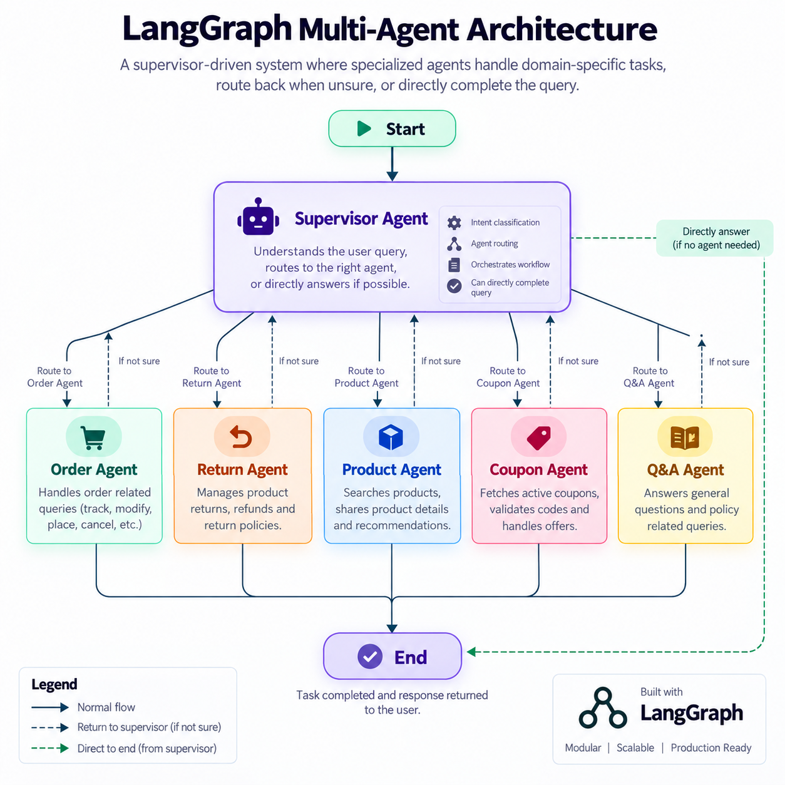

# BrightCart Support AI: Multi-Agent Customer Service with RAG

> A LangGraph-based multi-agent AI customer support system with controlled database access and grounded RAG for BrightCart.

## Overview

This is a LangGraph-based multi-agent AI customer support system where a supervisor routes queries to agents for orders, returns, products, coupons, and policy retrieval. Each agent can access the company database only through a fixed set of validated SQLAlchemy tools, never through raw SQL generated by the LLM. This controlled boundary eliminates SQL injection and prompt-injection-driven unscoped data access as an attack surface.

## Engineering Highlights

- **Injection-safe, scoped database access:** LLM agents interact with Postgres exclusively through typed SQLAlchemy tool functions and never through raw SQL. Each specialist receives only its predefined tools, preventing SQL injection and unscoped data access while connecting the LLM to a real company's data and actions.
- **True multi-agent orchestration, not a single mega-prompt:** A supervisor LLM classifies and routes queries to five specialist agents for orders, returns, products, coupons, and policy retrieval. Each is an independent LangGraph subgraph with its own scoped toolset, system prompt, and formal escalation path back to the supervisor.
- **Grounded policy retrieval:** Policy information comes from a RAG pipeline using Pinecone vector search and cross-encoder reranking over policy documents, rather than relying on the model's recollection of company policy.
- **Persistent memory and thread management:** LangGraph persistence stores conversation state in Postgres, while thread IDs and user IDs keep conversations organized and available across restarts.
- **Production-shaped, not a notebook demo:** The system includes a FastAPI backend with token streaming, a Streamlit frontend with Google OAuth login, and per-user thread isolation.
- **Identity never trusted from client input, at either layer:** The LLM never sees `user_id` in its context — it's injected server-side through LangGraph config, closing prompt-injection-driven impersonation. Separately, every `/chat/*` request derives `user_id` from a signed, expiring session token rather than a client-supplied field, and `/auth/google-sync` itself is gated behind a shared internal secret so only the trusted frontend can register a user.
- **Observable response path:** The project is monitored through the LangSmith interface. In typical chat turns, the observed end-to-end latency is approximately 3-4 seconds including tool calls, with actual timing varying by the requested action and retrieval work.

## Features

- SQLAlchemy-scoped database access with validated tool parameters instead of LLM-generated SQL.
- Supervisor-based routing across five specialist agents.
- **Order agent:** order details, user order history, order placement,  order modification, tracking, and ordered-product lookup.
- **Return agent:** return creation,item cancellation, return details, return history, refund coupons, and read-only order/product lookup.
- **Product agent:** product search and product detail lookup.
- **Coupon agent:** active coupon listing, coupon validation, and coupon creation.
- **Policy retrieval agent:** policy retrieval through Pinecone RAG using `retrieve_policy_info_tool`.
- `escalate_to_supervisor` is available to every specialist for formal escalation.
- The supervisor uses the smaller `openai/gpt-oss-20b` model to reduce cost and is activated again only when the active specialist sets `active_agent` to `not_sure`, rather than on every turn.
- Specialist agents use `openai/gpt-oss-120b` for their domain work.
- Google OAuth login and user synchronization.
- Per-user thread isolation and persisted chat history.
- Streaming assistant responses through the FastAPI backend.
- LangSmith monitoring of graph execution, tool calls, and approximate response latency.

## Architecture




The top-level graph uses an `AgentState` containing `messages` with an `add_messages` reducer and an optional `active_agent`. The supervisor uses ChatGroq structured output with a `RouteDecision` schema, returns a specialist name or `not_sure`, adds a clarification or greeting `AIMessage` when needed, and preserves an existing non-empty `active_agent` instead of reclassifying it.

Each specialist follows `START → specialist LLM node → tools_condition → (tools → back to specialist LLM node) | (end path) → check_escalation → END`. The application uses a `PostgresSaver` checkpointer through `CHECKPOINTER_DB_URI`, while application data uses a separate SQLAlchemy connection through `DATABASE_URL`. `thread_id` and `user_id` are passed through `LangGraph config["configurable"]`.

The RAG pipeline loads six policy PDFs from `Documents/`, splits them with `RecursiveCharacterTextSplitter` using 500-character chunks and 50-character overlap, creates MistralAI embeddings, and stores them in the Pinecone `ecommerce-policies` index. Policy retrieval uses MMR, Pinecone's `bge-reranker-v2-m3` reranker, and returns the top chunks through `retrieve_policy_info_tool`.

## Tech Stack

### Application Framework

- FastAPI 0.141.1
- Uvicorn 0.52.4
- Starlette 1.6.0
- Streamlit 1.62.0
- Pydantic 2.13.4
- SQLAlchemy 2.0.52
- psycopg-pool 3.3.1 (PostgreSQL)

### LLMs

- Supervisor node: `openai/gpt-oss-20b` through Groq
- Specialist agents: `openai/gpt-oss-120b` through Groq

The supervisor uses the smaller model for cost control and is reactivated when a specialist sets `active_agent` to `not_sure`, indicating that the current query is outside that specialist's scope.

### Framework & Libraries

- LangGraph 1.2.11
- LangGraph Prebuilt 1.1.0
- LangGraph Postgres checkpoint 3.1.2
- LangChain Core 1.6.0
- LangChain Groq 1.1.3
- LangChain Community 0.4.2
- LangChain Text Splitters 1.1.2
- LangChain Pinecone 0.2.13
- LangChain Mistralai 1.1.6
- Groq SDK 0.37.1
- LangSmith 0.11.1
- python-dotenv 1.2.3

### Retrieval

- Pinecone 7.3.0
- pypdf 6.16.2
- NumPy 2.5.2
- SciPy 1.18.0

### Frontend/HTTP

- HTTPX 0.28.1
- python-multipart 0.0.32

### Auth

- Google OAuth through the Streamlit frontend and Google user sync API

## Project Structure

```text
Customer Support AI Agent/
├── requirements.txt                 # Python dependencies
├── README.MD                         # Project documentation
├── create_tables.py                  # Creates all SQLAlchemy tables
├── embeddings.py                     # Loads policy PDFs and builds Pinecone vector store
├── Documents/                        # Six policy and FAQ PDFs
├── frontend/streamlit_app.py         # Streamlit Google-login chat frontend
├── app/
│   ├── main.py                       # FastAPI app and CORS setup
│   ├── agent/
│   │   ├── agent.py                  # Main LangGraph graph and PostgreSQL checkpointer
│   │   ├── memory.py                 # Agent memory support
│   │   ├── system_prompts.py         # Supervisor and specialist prompts
│   │   ├── subgraphs/                # Supervisor and specialist graphs
│   │   └── tools/                    # Agent tool implementations and wrappers
│   ├── api/
│   │   ├── auth.py                   # Google user sync endpoint
│   │   └── chat.py                   # Chat streaming and thread endpoints
│   ├── core/
│   │   ├── security.py               # Session-token auth + internal-caller gate for /auth/google-sync
│   │   └── db/                        # SQLAlchemy setup and models
│   └── utils/imptools.py             # Product lookup helper
└── .streamlit/secrets.toml           # Streamlit Google OAuth secrets
```

## Setup & Installation

### 1. Clone and install dependencies

```bash
git clone <repository-url>
cd "Customer Support AI Agent"
python -m venv .venv
```

Activate the virtual environment:

```bash
# Windows PowerShell
.venv\Scripts\Activate.ps1

# macOS/Linux
source .venv/bin/activate
```

Install the requirements:

```bash
pip install -r requirements.txt
```

### 2. Configure environment variables

Create a `.env` file at the project root with these variables. Do not commit secret values.

| Variable | Description |
| --- | --- |
| `CHECKPOINTER_DB_URI` | PostgreSQL connection string for LangGraph checkpoint persistence |
| `GROQ_API_KEY` | API key for Groq chat models used by the supervisor and specialists |
| `DATABASE_URL` | SQLAlchemy application database connection string |
| `PINECONE_API_KEY` | Pinecone API key |
| `MISTRAL_API_KEY` | Mistral embedding API key |
| `API_BASE` | Base URL the Streamlit frontend uses to call FastAPI |
| `INTERNAL_SERVICE_SECRET` | Shared secret required by the trusted frontend to call `/auth/google-sync` |
| `SESSION_SECRET` | Secret used to sign and verify expiring session tokens |
| `FRONTEND_ORIGIN` | Allowed Streamlit frontend origin for FastAPI CORS |

### 3. Prepare the database and vector store

Run the SQL table creation script once:

```bash
python create_tables.py
```

Run the ingestion pipeline once to load the policy PDFs from `Documents/` into Pinecone:

```bash
python ingest.py
```

### 4. Configure Google OAuth

Create and configure a Google OAuth client in Google Cloud Console. Streamlit OAuth configuration is also required in `.streamlit/secrets.toml` for Google login to work.

### 5. Run the application

Start the FastAPI backend in one terminal:

```bash
uvicorn app.main:app --reload --port 8000
```

Start the Streamlit frontend in a second terminal:

```bash
streamlit run frontend/streamlit_app.py
```

## API Reference

### `GET /health`

Returns the service health status.

**Response:**

```json
{"status": "ok"}
```

### `POST /auth/google-sync`

Only callable by the Streamlit frontend (gated by a shared `x-internal-secret` header). Finds a user by Google subject or email, updates or creates the user, and returns a signed, expiring session token.

**Request body:**

```json
{"email": "string", "google_sub": "string", "name": "string or null"}
```

**Required header:** `x-internal-secret: <shared secret>`

**Response body:**

```json
{"session_token": "string"}
```

### `POST /chat/stream`

Creates the thread if absent, invokes the persisted LangGraph agent, and streams assistant output. `user_id` is derived server-side from the verified session token, never accepted as request input. If no streamed chunks are produced, it reads the final AI message from saved graph state.

**Request body:**

```json
{"thread_id": "string", "message": "string"}
```

**Required header:** `Authorization: Bearer <session_token>`

**Response body:** HTTP streaming response with media type `text/plain`; the body contains assistant text chunks.

### `GET /chat/threads`

Lists the user's threads ordered by creation time descending.

**Required header:** `Authorization: Bearer <session_token>`

**Response body:**

```json
{"thread_ids": ["uuid-string", "uuid-string"]}
```

### `GET /chat/threads/{thread_id}/messages`

Verifies thread ownership, retrieves LangGraph checkpoint state, and returns conversation messages.

**Required header:** `Authorization: Bearer <session_token>`

**Response body:**

```json
{"thread_id": "uuid-string", "messages": [{"role": "user or assistant", "content": "string"}]}
```

## Database Schema

### `users`

| Column | Details |
| --- | --- |
| `user_id` | Primary key, integer |
| `email` | Unique, non-null, indexed |
| `name` | Non-null |
| `google_sub_id` | Unique, nullable |
| `role` | Defaults to `customer` |
| `created_at` | Creation timestamp |

Relationship: one user has many orders.

### `products`

| Column | Details |
| --- | --- |
| `prod_id` | Primary key, integer |
| `name` | Non-null |
| `description` | Nullable text |
| `price` | Non-null float |
| `stock` | Defaults to `0` |
| `category` | Indexed |

### `orders`

| Column | Details |
| --- | --- |
| `order_id` | Primary key, integer |
| `user_id` | Non-null foreign key to `users.user_id` |
| `status` | Defaults to `placed` |
| `total_amount` | Non-null float |
| `created_at` | Creation timestamp |

Relationships: many orders belong to one user; one order has many order items and many returns.

### `order_items`

| Column | Details |
| --- | --- |
| `orderitem_id` | Primary key, integer |
| `order_id` | Non-null foreign key to `orders.order_id` |
| `product_id` | Non-null foreign key to `products.prod_id` |
| `quantity` | Non-null |
| `price_at_purchase` | Non-null float |

### `returns`

| Column | Details |
| --- | --- |
| `return_id` | Primary key, integer |
| `order_id` | Non-null foreign key to `orders.order_id` |
| `order_item_id` | Non-null foreign key to `order_items.orderitem_id` |
| `reason` | Non-null text |
| `status` | Defaults to `requested` |
| `created_at` | Creation timestamp |

### `coupons`

| Column | Details |
| --- | --- |
| `coupon_id` | Primary key, integer |
| `code` | Unique, non-null, indexed |
| `discount_percent` | Non-null float |
| `valid_till` | Non-null datetime |
| `is_active` | Defaults to `True` |

### `threads`

| Column | Details |
| --- | --- |
| `thread_id` | Primary key, PostgreSQL UUID, generated by default |
| `user_id` | Non-null foreign key to `users.user_id` |
| `created_at` | Creation timestamp |

## Future Scope

- **Human-in-the-loop support:** Add a human handoff when a request goes beyond the AI's scope, with integration into an existing customer support or ticketing system.
- **Payment status integrations:** Connect payment gateways to support payment verification and payment-aware cancellation workflows.
- **Email support:** Allow the agent to automatically send the respective user an email summarizing a resolved query or confirming an action.
- **Richer operational integrations:** Extend the tool boundary to cover shipment status, notifications, order refunds, and other verified business actions while keeping database access controlled.
- **Same-turn graph handoffs:** Re-route escalated requests within a single graph execution so the user does not need to send a follow-up message.

## License

MIT - see `LICENSE` file.
